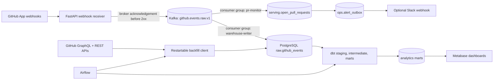

# GitHub Engineering Analytics Pipeline

## Architecture Review and 15-Day Build Plan

Status: Ready for implementation  
Reviewed: July 21, 2026  
Target: Portfolio-grade MVP in 15 focused working days

> **Decision:** Keep Kafka, Airflow, dbt, PostgreSQL, FastAPI, and Metabase. Remove Redis, Schema Registry/Avro, bronze promotion, and Great Expectations from the MVP. Spend the saved time on delivery correctness, idempotency, tests, CI, metric integrity, reproducible demo data, and documentation.

## 1. Executive assessment

The original concept is strong enough to interest data-platform employers and senior engineers. It combines event ingestion, stream processing, batch recovery, analytics engineering, orchestration, data quality, and visualization around a problem engineering leaders recognize.

The original plan would not yet withstand a rigorous senior review. Its most important weaknesses are architectural rather than cosmetic:

- The sample webhook producer calls `produce()` and `poll(0)` but returns before receiving a broker delivery acknowledgement. The stated `acks=all` guarantee therefore is not established at the HTTP boundary.
- GitHub records a webhook delivery as failed if the receiver exceeds its response window, and failed deliveries are not automatically redelivered. The plan needs an explicit failure and reconciliation strategy.
- A failed GitHub Actions workflow is not automatically a production change failure. The original plan overstates what can be called a DORA metric.
- DORA now defines five software-delivery metrics, not the original four. Instability metrics require intervention, rollback, hotfix, incident, or rework evidence that GitHub events may not contain without repository-specific conventions.
- Five event-specific raw topics, Avro, Schema Registry, Redis, separate bronze promotion, Great Expectations, and four dashboards create breadth without enough time to prove each component.
- Contributor leaderboards invite misuse as individual performance scoring. System- and team-level flow metrics are more defensible.
- The plan gives too little attention to CI, failure injection, contract tests, replayable fixtures, security boundaries, runbooks, and a one-command demo.
- Metabase serialization is a paid feature, so an open-source portfolio cannot promise portable collection exports without another provisioning approach.

The revised plan preserves the technically distinctive parts while making every claim testable.

## 2. Portfolio value

### What will attract experienced reviewers

- A defensible reason for Kafka: a fast webhook acknowledgement path, independent consumer groups, replay, backpressure, and failure isolation.
- Explicit at-least-once semantics with database idempotency and offset commits after the database transaction.
- An append-only raw event store that preserves the original payload and lineage.
- A hybrid live-plus-backfill design with rate-limit awareness and restartable checkpoints.
- Metric definitions that distinguish measured values, configured proxies, unavailable values, and coverage gaps.
- Failure drills that prove behavior when Kafka or PostgreSQL is unavailable and when a consumer crashes between database and offset commits.
- An implementation that starts from fixtures and can be demonstrated without exposing a private repository or waiting for live traffic.
- A concise README with architecture, screenshots, measured demo results, limitations, and a five-minute quickstart.

### What will reduce credibility

- Treating every tool as mandatory because it appears in a data-engineering stack diagram.
- Calling CI failures production incidents or claiming complete DORA coverage from incomplete evidence.
- Claiming “exactly once” end to end. The design is at-least-once with idempotent effects.
- Publishing benchmark numbers before they have been measured on a documented machine and workload.
- Showing individual activity rankings without governance, context, or an explicit non-evaluation policy.
- Depending on unpinned `latest` container tags.

## 3. Product goal and scope

### Goal

Build a local-first platform that ingests GitHub engineering events, recovers historical data, produces trustworthy repository- and service-level delivery-flow metrics, and demonstrates how the system behaves under duplicates and partial failures.

### MVP outcomes

The MVP must answer these questions:

1. Can a signed GitHub webhook be durably acknowledged to Kafka inside GitHub's response window?
2. Can two independent consumers process the same event stream without coupling their progress?
3. Can raw events be replayed without duplicate warehouse effects or duplicate alerts?
4. Can historical backfill coexist with live ingestion using explicit source identities?
5. Which delivery metrics are genuinely measured, which depend on repository configuration, and what percentage of records can be linked?
6. Can another engineer run a deterministic demo and understand failure behavior from the repository alone?

### Non-goals for the MVP

- A production-grade, multi-broker Kafka deployment.
- Organization-wide employee performance measurement.
- Generic support for every GitHub webhook event.
- Real-time dashboard refresh; analytical marts refresh on an Airflow schedule.
- A cloud deployment or Kubernetes platform.
- Complete DORA instability metrics without explicit intervention or incident signals.
- Metabase Pro/Enterprise serialization.

## 4. Revised architecture



### 4.1 Webhook receiver

`POST /webhooks/github` performs only the synchronous work required to establish a durable boundary:

1. Read the unmodified request body with a configured size limit.
2. Validate `X-Hub-Signature-256` with a constant-time comparison.
3. Require `X-GitHub-Event` and `X-GitHub-Delivery`; allow only subscribed event families.
4. Build a versioned envelope without discarding the original JSON payload.
5. Publish to Kafka with `repo_id` as the key.
6. Wait for the delivery callback or delivery timeout before returning a 2xx response.
7. Return a non-2xx response when Kafka does not acknowledge the record. Record the failure with structured logs and rely on the reconciliation workflow or manual redelivery.

The endpoint must not use `producer.poll(0)` as proof of delivery. The asynchronous producer may queue locally without broker acknowledgement. The implementation can wrap the delivery callback in an awaitable or run a bounded flush in a worker thread; the integration test, not the implementation style, establishes the guarantee.

### 4.2 Event contract and Kafka topics

Core topics:

| Topic | Key | Purpose | Local partitions |
|---|---|---|---:|
| `github.events.raw.v1` | `repo_id` | Validated webhook envelopes for all supported event families | 3 |
| `github.events.dlq.v1` | `delivery_id` | Poison records that a consumer cannot parse or apply | 1 |

Supported MVP event families:

- `pull_request`
- `pull_request_review`
- `workflow_run`
- `deployment`
- `deployment_status`

Issues, pushes, review comments, and derived Kafka topics are stretch scope. Pull-request commits and workflow-run history are recovered through the backfill APIs.

The envelope fields are:

```json
{
  "schema_version": 1,
  "delivery_id": "github-delivery-guid",
  "event_name": "pull_request",
  "action": "opened",
  "installation_id": 123456,
  "repository_id": 987654,
  "repository_full_name": "owner/repository",
  "received_at": "2026-07-21T18:00:00Z",
  "payload": {}
}
```

Pydantic and checked-in JSON Schema define the MVP contract. Schema Registry and Avro move to a later decision point: add them when independently deployed teams require compatibility enforcement or when contract evolution becomes frequent enough to justify the operational cost.

Keying by repository preserves Kafka's partition order of arrival; it does not prove chronological GitHub event order. Consumers and dbt models use source timestamps, stable identities, and monotonic state rules so delayed or redelivered events cannot move a projection backward.

Local Kafka runs as one KRaft broker. That setup demonstrates client semantics but not host-level durability. Production guidance documents three or more brokers, replication, TLS/SASL, and managed storage without pretending the local stack provides those guarantees.

### 4.3 Warehouse writer consumer

The `warehouse-writer` consumer group:

- Deserializes and validates the envelope.
- Inserts the complete payload into `raw.github_events`.
- Uses a unique source identity to make reprocessing harmless.
- Commits the PostgreSQL transaction before committing the Kafka offset.
- Sends unprocessable records to the DLQ and waits for the DLQ acknowledgement before committing the source offset.
- Emits structured logs and Prometheus metrics with delivery, repository, partition, offset, and processing outcome.

A crash after the database commit but before the Kafka offset commit replays the event. The database uniqueness constraint absorbs the duplicate. This is at-least-once processing with idempotent effects, not end-to-end exactly-once delivery.

### 4.4 Pull-request monitor and alert outbox

The independent `pr-monitor` consumer group proves Kafka fan-out. It maintains a durable PostgreSQL projection rather than adding Redis to the MVP:

- `serving.open_pull_requests` stores PR state, first eligible review time, and alert state.
- A non-author submitted review establishes first-review time.
- A periodic sweep creates a unique `ops.alert_outbox` row for a stale PR.
- An optional dispatcher posts the outbox message to Slack and records success or retry state.
- Replayed events and repeated sweeps cannot create duplicate alerts because the outbox has a unique alert key.

PostgreSQL is sufficient for the expected portfolio workload, survives consumer restarts, and removes a service whose latency characteristics are not required. Redis becomes a documented scale-out option if the projection or sweep workload later justifies it.

### 4.5 Raw storage and source identities

`raw.github_events` is append-only and includes:

| Column | Purpose |
|---|---|
| `event_id` | Internal UUID primary key |
| `source` | `webhook` or `backfill` |
| `source_record_key` | Stable identity within the source |
| `delivery_id` | GitHub delivery GUID for webhook rows; null for backfill rows |
| `event_name`, `action` | Routing and modeling fields |
| `repository_id`, `installation_id` | Tenant and lineage fields |
| `occurred_at`, `received_at`, `ingested_at` | Source, receiver, and warehouse times |
| `payload` | Full original JSONB payload |
| `kafka_partition`, `kafka_offset` | Stream lineage for webhook rows |

The uniqueness boundary is `(source, source_record_key)`. Backfill records do not fabricate webhook delivery IDs. Each backfill adapter defines a stable key from the GitHub node or REST resource and relevant action/state.

### 4.6 Historical backfill

The backfill client is a tested Python package invoked by Airflow, not business logic embedded in a DAG file.

- GraphQL retrieves pull requests, reviews, and commit relationships where it provides an efficient connection model.
- REST retrieves GitHub Actions workflow runs and deployment resources.
- The client reads the returned rate-limit state and response headers rather than assuming a universal 5,000-point allowance.
- Checkpoints persist repository, resource, time window, and cursor/page so a retry resumes safely.
- Primary and secondary rate-limit responses cause bounded backoff with jitter.
- Upserts share the raw table's source-identity contract and remain idempotent.

### 4.7 Airflow orchestration

Use Apache Airflow 3.3 with Python 3.12 and official constraints.

Core DAGs:

| DAG | Schedule | Responsibilities |
|---|---|---|
| `github_backfill` | Manual, parameterized | Run restartable history extraction for a repository and time range |
| `analytics_refresh` | Hourly | Check source watermark, run `dbt build`, persist run artifacts and status |
| `webhook_reconciliation` | Hourly when App credentials are configured | Find recent failed GitHub App deliveries, request redelivery, and alert on repeated failure |

Do not create five separately scheduled DAGs connected by timing assumptions. Within the scheduled analytics flow, task dependencies express ordering directly. Airflow assets are a documented extension if independently scheduled downstream workflows later need data-aware triggers.

The streaming consumers remain long-lived services. Airflow does not poll Kafka and does not orchestrate per-event work.

### 4.8 dbt models

Model layers:

| Layer | Representative models | Responsibility |
|---|---|---|
| Staging | `stg_github__pull_requests`, `stg_github__reviews`, `stg_github__workflow_runs`, `stg_github__deployments` | Extract and type JSON, normalize identities, expose source freshness |
| Intermediate | `int_pr_lifecycle`, `int_first_eligible_review`, `int_production_deployments`, `int_change_to_deployment` | Stateful event resolution and reusable business logic |
| Marts | `fct_pull_requests`, `fct_deployments`, `fct_delivery_performance_daily`, `dim_repository`, `dim_date` | Stable dashboard-facing grains and documented metrics |

Use dbt data tests, unit tests, model contracts, and source freshness. Great Expectations is not part of the MVP because it would duplicate most deterministic checks while adding another configuration surface. Reconsider it when cross-table statistical validation has a concrete owner, minimum history, and response playbook.

## 5. Metric integrity

### 5.1 Current DORA model

DORA's current model contains five software-delivery metrics:

1. Deployment frequency.
2. Change lead time.
3. Failed deployment recovery time.
4. Change fail rate.
5. Deployment rework rate.

These metrics are intended for an application or service in context. They are not employee rankings and should not be compared indiscriminately across unrelated services.

### 5.2 Repository configuration

`seeds/repository_metric_config.csv` defines the evidence rules per repository:

- Production environment names.
- One primary production-deployment signal: deployment status or configured workflow, never both for the same repository.
- Default branch.
- Incident labels or issue conventions, if used.
- Rollback, hotfix, and unplanned-rework conventions, if used.
- Repository timezone and optional business-hours calendar.

No repository receives an instability metric unless its configuration supplies the necessary evidence.

### 5.3 Metric status and coverage

Every metric result carries:

- `measurement_status`: `measured`, `configured_proxy`, or `unavailable`.
- `coverage_ratio`: linked eligible records divided by eligible records.
- `definition_version`: the checked-in metric definition version.
- `exclusion_reason`: why records or a metric are unavailable.

Core MVP metrics:

| Metric | MVP status | Evidence |
|---|---|---|
| Deployment frequency | Measured after repository configuration | Successful production deployment or configured production workflow |
| Change lead time | Measured with coverage | Commit-to-successful-production-deployment mapping |
| Failed deployment recovery time | Unavailable by default | Requires failed deployment that needed intervention and a recovery event |
| Change fail rate | Unavailable by default | Requires rollback, hotfix, incident, or other immediate-intervention evidence |
| Deployment rework rate | Unavailable by default | Requires an unplanned deployment linked to production incident recovery |

Do not substitute every failed workflow run for a change failure. A CI failure may occur before production and may require no intervention.

### 5.4 Pull-request flow metrics

The GitHub-only data can support useful leading indicators without mislabeling them as DORA metrics:

- Time to first eligible non-author review.
- Time from first review to merge.
- Total PR cycle time.
- Open-PR age and work-in-progress count.
- Review rework cycles.
- PR size bands versus review latency.

Dashboards aggregate at repository or service level. Contributor identities may appear only where operationally necessary, such as the owner of a currently stale PR, and the documentation explicitly prohibits use as an individual productivity score.

## 6. Technology decisions

Pin exact patch versions and immutable container tags during implementation. The reviewed baseline is:

| Technology | MVP choice | Rationale |
|---|---|---|
| Python | 3.12 | Supported across Airflow 3.3, dbt Core v1, and GX if later added |
| FastAPI | Current compatible pinned release | Typed webhook and health endpoints with a small surface |
| Kafka | Apache Kafka 4.3.1, official JVM image, KRaft | Current official image; no ZooKeeper; suitable for local semantics demo |
| Kafka client | `confluent-kafka` compatible pinned release | Mature librdkafka client and explicit delivery callbacks |
| PostgreSQL | 17 | Supported by Airflow 3.3 and sufficient for raw JSONB, projections, and marts |
| Airflow | 3.3.0 with official constraints | Current stable orchestration model and Python 3.12 support |
| dbt | dbt Core/dbt-postgres 1.12.x | Stable open-source v1 line; model tests, unit tests, and contracts |
| Metabase | OSS 0.63.x | Fast local analytical dashboards; SQL and screenshots remain versioned |
| Packaging | `uv` for application services; Airflow constraints for Airflow image | Reproducible application locks without bypassing Airflow's supported install path |

### Deferred technologies

| Technology | Decision trigger |
|---|---|
| Schema Registry + Avro | Multiple independently deployed producers/consumers or frequent contract evolution |
| Redis | Projection latency or sweep scale exceeds indexed PostgreSQL behavior |
| Great Expectations | Statistical validations have enough history, unique value beyond dbt, and an operational response |
| Prometheus server/Grafana | Metrics need retained operational dashboards beyond endpoint inspection |
| Object storage/Parquet | Event volume or retention makes PostgreSQL raw storage inappropriate |

## 7. Repository structure

```text
github-engineering-analytics/
|-- .github/
|   |-- workflows/
|   `-- dependabot.yml
|-- airflow/
|   |-- dags/
|   `-- Dockerfile
|-- dashboards/
|   |-- sql/
|   `-- screenshots/
|-- dbt/
|   `-- github_analytics/
|       |-- models/
|       |-- seeds/
|       |-- snapshots/
|       `-- tests/
|-- docs/
|   |-- adr/
|   |-- architecture.md
|   |-- dashboard-setup.md
|   |-- metric-definitions.md
|   |-- operations-runbook.md
|   `-- security.md
|-- infra/
|   |-- docker-compose.yml
|   `-- init/
|-- schemas/
|   `-- github-event-envelope-v1.json
|-- src/
|   `-- github_analytics/
|       |-- backfill/
|       |-- common/
|       |-- consumers/
|       `-- webhook/
|-- tests/
|   |-- contract/
|   |-- e2e/
|   |-- fixtures/
|   |-- integration/
|   `-- unit/
|-- .env.example
|-- BUILD_PLAN.md
|-- LICENSE
|-- Makefile
|-- README.md
|-- pyproject.toml
`-- uv.lock
```

## 8. Testing and evidence strategy

### Unit tests

- HMAC verification, missing headers, request limits, and event routing.
- Envelope construction and schema-version rejection.
- Backfill pagination, checkpoint resume, primary rate-limit reset, and secondary-limit backoff.
- PR state transitions and non-author first-review selection.
- Metric classification, coverage, and unavailable-state rules.

### Contract tests

- Sanitized fixtures for every supported webhook event and important action.
- JSON Schema and Pydantic compatibility.
- Unknown fields accepted; required envelope fields enforced.
- Old version fixtures retained when the contract evolves.

### Integration tests

- Signed webhook reaches Kafka and receives a 2xx only after broker acknowledgement.
- Broker outage causes a bounded non-2xx response.
- Duplicate deliveries create one raw row.
- Consumer crash after database commit and before offset commit produces one durable effect after replay.
- Poison message reaches the DLQ before the source offset advances.
- Two consumer groups advance independently.
- Repeated stale-PR sweeps produce one outbox alert.

### dbt tests

- Unique and not-null grain keys.
- Relationships to repository and date dimensions.
- Accepted event and deployment states.
- Source freshness and ingestion-delay checks.
- Review timestamps do not precede PR creation.
- Deployment mappings do not produce negative lead times.
- Daily metric unit tests cover empty days, duplicates, missing configuration, and partial linkage.
- Model contracts protect dashboard-facing columns and types.

### End-to-end demo and failure drills

The checked-in fixture replayer must provide a deterministic demo. A live GitHub App demo is additional evidence, not the only path.

Before release, record actual results for:

- A 500-event burst through the receiver.
- Duplicate replay.
- Kafka outage and recovery.
- PostgreSQL outage and consumer restart.
- Backfill interruption and cursor resume.
- A live PR open, review, merge, and configured deployment.

Acceptance targets are zero lost acknowledged events, zero duplicate durable effects, webhook acknowledgement below GitHub's failure window, and documented p50/p95 timings from a named machine and workload. Do not publish invented performance results.

## 9. CI, security, and operability

### Continuous integration

Every pull request runs:

- Ruff formatting and linting.
- mypy on application code.
- pytest unit and contract suites with coverage reporting.
- Docker image builds.
- dbt parse, unit tests, and data tests against a PostgreSQL service.
- Integration smoke tests for Kafka and PostgreSQL on changes to ingestion code.
- Secret scanning and dependency review where GitHub provides them.

### Security controls

- No personal access token in source or Airflow Variables committed to Git.
- GitHub App installation tokens use minimum repository permissions.
- The App private key and webhook secret are injected at runtime.
- HMAC validation operates on raw bytes and uses constant-time comparison.
- Logs exclude tokens, signatures, and full private payloads by default.
- Fixture payloads are sanitized and documented.
- Metabase uses a read-only database role restricted to analytics schemas.
- Container images and Python dependencies are pinned; Dependabot tracks updates.

### Operability

Each service exposes:

- `/health/live` for process liveness.
- `/health/ready` for required dependency readiness.
- `/metrics` for request counts, publish results, consumer lag, processed records, duplicates, DLQ records, and processing latency.
- Structured JSON logs correlated by `delivery_id`, `repository_id`, partition, and offset.

The runbook covers replay, DLQ inspection, offset-reset safeguards, backfill resume, webhook redelivery, secret rotation, and local-data reset.

## 10. Dashboards and presentation

### Dashboard 1: Delivery performance

- Deployment frequency trend by configured service/repository.
- Change lead-time median and percentile trend.
- Measurement status and coverage beside every metric.
- Instability metrics shown only when configured evidence exists; otherwise display “Unavailable” with the missing evidence.

### Dashboard 2: Pull-request flow

- Time-to-first-review distribution and percentile trend.
- PR cycle-time trend by repository and size band.
- Open PR aging and work-in-progress.
- Review rework cycles.

### Dashboard 3: Pipeline health and trust

- Source freshness and event-ingestion delay.
- Duplicate deliveries absorbed.
- DLQ records and last failure reason.
- Last successful Airflow/dbt run.
- Metric linkage coverage and excluded-record counts.

Metabase OSS dashboards are documented with versioned SQL, setup instructions, and screenshots. Do not claim that paid serialization exports are part of the open-source workflow.

## 11. Fifteen-day implementation schedule

The estimate assumes focused working days and an MVP-first approach. Day 10 is a scope gate. If the core path is not green, defer Slack delivery, webhook reconciliation automation, and the third dashboard before compromising tests or documentation.

| Day | Focus | Exit evidence |
|---:|---|---|
| 1 | Repository scaffold, dependency locks, Docker Compose, CI skeleton, ADRs | Kafka and PostgreSQL healthy; lint and unit workflow green |
| 2 | Event envelope, JSON Schema, sanitized fixtures, HMAC receiver | Unit and contract tests cover signed and rejected requests |
| 3 | Kafka producer acknowledgement path and health/metrics endpoints | Broker-outage integration test proves bounded non-2xx behavior |
| 4 | Raw schema and warehouse-writer consumer | Duplicate and crash-window integration tests pass |
| 5 | PR-monitor projection and alert outbox | Two consumer groups and duplicate alert protection demonstrated |
| 6 | Backfill package: PRs, reviews, commits | Pagination, checkpoints, and rate-limit tests pass |
| 7 | Workflow-run/deployment backfill and Airflow image | Manual backfill DAG resumes after interruption |
| 8 | dbt sources, staging models, contracts, and source freshness | `dbt build` green on deterministic fixtures |
| 9 | PR lifecycle and deployment intermediate models | Known fixture outcomes match manual calculations |
| 10 | Delivery-performance marts, metric status, and coverage | Core vertical slice visible in SQL; scope gate decision recorded |
| 11 | Delivery and PR-flow dashboards | Versioned queries and first screenshot set complete |
| 12 | Scheduled analytics DAG and pipeline health data | Airflow run persists status and refreshes marts |
| 13 | End-to-end replay, failure drills, and measured benchmark | Evidence table contains actual results and environment details |
| 14 | README, architecture, metric definitions, security, runbook, demo script | A fresh clone follows the documented quickstart successfully |
| 15 | Hardening, dependency audit, release candidate, and review | CI green, no secrets, screenshots current, release checklist signed off |

### Milestones

- **Day 5:** streaming vertical slice.
- **Day 10:** analytics vertical slice and scope gate.
- **Day 15:** portfolio release candidate.

## 12. Branch, commit, and pull-request strategy

Never implement directly on `main`. Protect `main` after the remote repository is created and require pull-request checks.

Recommended branches:

- `foundation/repository-scaffold`
- `feature/webhook-ingestion`
- `feature/warehouse-consumer`
- `feature/backfill-orchestration`
- `feature/analytics-models`
- `feature/dashboards-demo`
- `hardening/release-readiness`

Branches should remain reviewable and normally live for one to three working days. Rebase or merge the latest `main` before final review according to the repository policy; do not mix unrelated refactors into feature branches.

Commit at verified checkpoints. Example commit subjects:

- `build: scaffold local data platform services`
- `feat: validate and publish github webhooks`
- `test: prove idempotent event landing`
- `feat: add restartable github history backfill`
- `feat: model pull request and deployment flow`
- `docs: add dashboard guide and operations runbook`

Each pull request includes:

- Problem and user-visible outcome.
- Architecture or data-contract decisions.
- Tests and commands run.
- Screenshots or sample output where relevant.
- Failure and rollback considerations.
- Follow-up work explicitly deferred.

## 13. Release acceptance checklist

- [ ] Fresh clone starts the core stack with documented commands.
- [ ] No implementation work was committed directly to `main`.
- [ ] All images and dependencies use pinned versions or digests.
- [ ] Webhook signature validation and broker acknowledgement are tested.
- [ ] Raw writes and alert effects are idempotent under replay.
- [ ] Kafka offsets advance only after durable effects or DLQ acknowledgement.
- [ ] Backfill is restartable and rate-limit aware.
- [ ] dbt models have documented grains, contracts, tests, and lineage.
- [ ] DORA labels match available evidence and show coverage.
- [ ] Individual contribution leaderboards are absent.
- [ ] CI, failure drills, and actual benchmark evidence are green.
- [ ] README includes architecture, quickstart, screenshots, limitations, and demo steps.
- [ ] Security and operations runbooks are complete.
- [ ] The final implementation PR contains a concise reviewer-oriented summary.

## 14. Deferred extensions

Add only after the MVP release:

- Schema Registry and Avro compatibility tests.
- Redis projection store and higher-volume alert sweeps.
- Great Expectations statistical checks with minimum-history guards.
- Object storage and Parquet raw lake.
- Managed Kafka or cloud warehouse deployment.
- OpenTelemetry traces and retained Prometheus/Grafana dashboards.
- Additional GitHub event families and organization-level installations.
- Incident-system integration for defensible instability metrics.

## 15. Primary research basis

- [GitHub: Handling failed webhook deliveries](https://docs.github.com/en/webhooks/using-webhooks/handling-failed-webhook-deliveries)
- [GitHub: Redelivering webhooks](https://docs.github.com/en/webhooks/testing-and-troubleshooting-webhooks/redelivering-webhooks)
- [GitHub: Webhook events and payloads](https://docs.github.com/en/webhooks/webhook-events-and-payloads)
- [GitHub: GraphQL API rate and query limits](https://docs.github.com/en/graphql/overview/rate-limits-and-query-limits-for-the-graphql-api)
- [GitHub: REST API endpoints for workflow runs](https://docs.github.com/en/rest/actions/workflow-runs)
- [Apache Kafka 4.3: Producer configuration](https://kafka.apache.org/43/configuration/producer-configs/)
- [Apache Kafka 4.3: Docker image guidance](https://kafka.apache.org/43/getting-started/docker/)
- [Apache Airflow 3.3: Release notes](https://airflow.apache.org/docs/apache-airflow/stable/release_notes.html)
- [Apache Airflow 3.3: Installation prerequisites](https://airflow.apache.org/docs/apache-airflow/stable/installation/prerequisites.html)
- [Apache Airflow 3.3: Asset-aware scheduling](https://airflow.apache.org/docs/apache-airflow/stable/authoring-and-scheduling/asset-scheduling.html)
- [dbt: Install and version compatibility](https://docs.getdbt.com/docs/local/install-dbt)
- [dbt: Data tests](https://docs.getdbt.com/docs/build/data-tests)
- [dbt: Unit tests](https://docs.getdbt.com/docs/build/unit-tests)
- [dbt: Model contracts](https://docs.getdbt.com/docs/mesh/govern/model-contracts)
- [DORA: Software delivery performance metrics](https://dora.dev/guides/dora-metrics/)
- [Metabase: Serialization availability](https://www.metabase.com/docs/latest/installation-and-operation/serialization)
