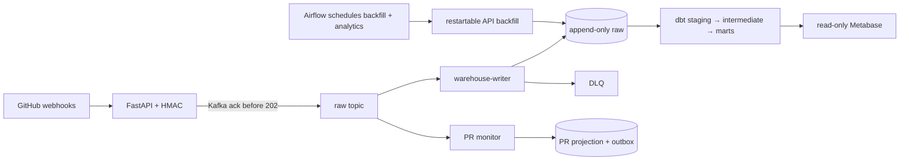
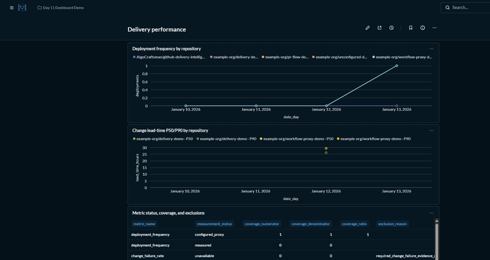
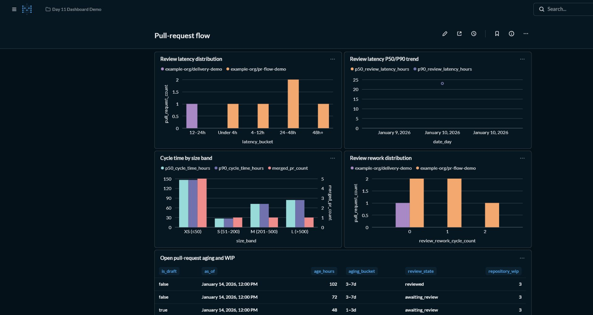

# GitHub Delivery Intelligence

An event-driven engineering analytics portfolio project that turns GitHub App
webhooks and historical API data into replayable pull-request flow and
evidence-aware delivery metrics. Kafka, PostgreSQL, dbt, Airflow, FastAPI, and
Metabase are connected through explicit acknowledgement, transaction, lineage,
coverage, and security boundaries.

The portfolio value is the evidence discipline: duplicate delivery and crash windows
have durable idempotency boundaries; unavailable metrics stay null with reasons; CI
failures are not mislabeled as production failures; dashboards are backed by versioned
SQL and deterministic fixtures; and measured claims link to reproducible local
evidence.

## Architecture at a glance



The two Kafka consumers use independent groups. PostgreSQL effects or acknowledged
dead letters happen before source offsets advance. Airflow schedules backfill and
analytics work; it does not poll Kafka or orchestrate individual events. This is
at-least-once processing with idempotent durable effects, not end-to-end exactly-once
delivery. See [Architecture](docs/architecture.md) for boundaries and limitations.

## Five-minute quickstart

Prerequisites:

- Python 3.12.13
- uv 0.11.29
- Docker Desktop with Docker Compose v2
- GNU Make

From a fresh clone, install the locked environment and run the ordinary deterministic
demo:

```bash
uv sync --frozen
make demo
make ps
```

`make demo` starts the core Kafka and PostgreSQL services, creates the raw and DLQ
topics, applies idempotent migrations, reloads only the isolated
`raw.github_events_fixture` table, runs fixture-backed dbt freshness/build assertions,
validates dashboard SQL, and prints the evidence-aware metric rows. It requires no
GitHub token, private key, real repository, or `.env` file. Repeating it does not
truncate or mutate append-only `raw.github_events`.

Initial image downloads or dependency installation can extend the first run beyond
five minutes; the workflow itself is the reviewer quickstart once prerequisites are
available. Troubleshooting and recovery are in the
[operations runbook](docs/operations-runbook.md).

Stop the core services without deleting their named volumes:

```bash
make down
```

Do not use `docker compose down -v` for routine shutdown, migration, or recovery.

To run a second deterministic stack concurrently in PowerShell, give it a distinct
Compose project and unused host ports:

```powershell
$env:COMPOSE_PROJECT_NAME = 'github-delivery-intelligence-day14-isolated'
$env:KAFKA_PORT = '19092'
$env:POSTGRES_PORT = '55433'
$env:DBT_POSTGRES_PORT = '55433'

uv sync --frozen
make demo
make ps
```

`KAFKA_PORT` and `POSTGRES_PORT` control the host bindings, while
`DBT_POSTGRES_PORT` must match the overridden PostgreSQL host port. The distinct
`COMPOSE_PROJECT_NAME` isolates container, network, and volume names. Stop that
project with ordinary `make down` while the same variables are set; this preserves
its volumes. Never use `down -v` for this workflow.

## What the demo proves

The deterministic workflow proves that the checked-in synthetic source data is fresh,
all contracted dbt models and fixture assertions pass, metric status/coverage
semantics match expected outcomes, dashboard SQL matches its reviewed snapshot, and
the core services start with idempotent migrations.

It does not exercise a live GitHub App, real webhook secret, real installation token,
Metabase content import, a production Airflow deployment, dependency outages, or
production capacity. The heavier `make day13-evidence` workflow is deliberately
separate because it appends unique synthetic live-raw history and temporarily stops
Kafka and PostgreSQL for failure drills.

## Dashboards

Start the optional local Metabase profile after the demo:

```bash
make dashboard-up
```

Open <http://localhost:3000>. The documented local administrator is
`demo@example.invalid` / `local_only_metabase_demo1`; the database reader is
`metabase_reader` / `local_only_read_only`. These are local-demo values only and are
not production-safe. The open-source workflow uses versioned SQL and manual Metabase
configuration; it does not claim paid serialization.





Card definitions, fixture outcomes, screenshot procedure, and query contracts are in
the [dashboard guide](dashboards/README.md). Stop only Metabase while preserving its
application data with `make dashboard-down`.

## Metric availability

| Metric | Current status | Evidence and coverage |
|---|---|---|
| Deployment frequency | `measured` or `configured_proxy` | Configured primary evidence / all candidate production evidence |
| Change lead time | `measured` or `configured_proxy` when linked | Exact-SHA-linked eligible merged changes / eligible merged changes |
| Failed deployment recovery time | `unavailable` | Intervention and recovery evidence is not configured or modeled |
| Change failure rate | `unavailable` | Production failure and remediation evidence is not configured or modeled |
| Deployment rework rate | `unavailable` | Unplanned-rework evidence is not configured or modeled |

Unavailable values remain null with machine-readable exclusion reasons. Workflow-run
production evidence is an explicitly configured proxy; a CI failure is not a
production failure. Results are repository/service aggregates and must not be used for
contributor ranking or individual-performance reporting. Exact formulas, grains,
inclusion rules, PR-flow definitions, and interpretation cautions are in
[Metric definitions](docs/metric-definitions.md).

## Measured replay and failure evidence

The checked-in Day 13 report records an observed local Docker Desktop run, not a target
or production benchmark:

| Evidence | Observed result |
|---|---:|
| Signed webhook burst | 500/500 returned `202` after Kafka acknowledgement |
| Unique append-only raw rows | 500 |
| Lost acknowledged events | 0 |
| Receiver HTTP-to-Kafka-ack throughput | 179.892 requests/s |
| Receiver latency | p50 120.050 ms; p95 194.072 ms; max 225.366 ms |
| Initial warehouse processing | 89.807 records/s; p95 7.465 ms |
| Duplicate replay | 500 duplicate outcomes; 0 duplicate durable effects |
| Duplicate-processing-to-offset-commit | 408.005 records/s; p95 2.804 ms |
| Crash after database commit | Replay produced one durable row and `duplicate` |
| Poison record | Acknowledged DLQ bytes/lineage before source offset advancement |
| Kafka outage | Bounded `503`, recovery `202`, one durable row |
| PostgreSQL outage | No source-offset advance; restart replay inserted the row |
| Backfill resume | Continued at page 2 and completed with two durable rows |
| Synthetic checks | 7 passed |
| Live GitHub App PR lifecycle | `unavailable` |

The run used one local Kafka broker and one local PostgreSQL instance. It is semantic
and local workload evidence, not high availability or production capacity evidence.
Environment details, provenance, scopes, and exact commands are in
[Day 13 evidence](docs/day-13-evidence.md) and the [e2e guide](tests/e2e/README.md).

## Running the services

Copy `.env.example` to ignored `.env` and replace its fake values before connecting to
a real GitHub App. Start each long-running process under a separate supervisor or
terminal:

```bash
make webhook
make warehouse
make pr-monitor
```

The receiver exposes:

- `POST /webhooks/github` for signed supported events;
- `GET /health/live` for process liveness;
- `GET /health/ready` for bounded Kafka readiness; and
- `GET /metrics` for Prometheus text metrics.

Historical backfill requires a short-lived token and explicit half-open window:

```bash
make backfill \
  BACKFILL_START=2026-01-01T00:00:00Z \
  BACKFILL_END=2026-02-01T00:00:00Z
```

Each API page and restart checkpoint commits in one PostgreSQL transaction. See the
[operations runbook](docs/operations-runbook.md) for service operation, DLQ inspection,
offset safeguards, backfill resume, outage recovery, Airflow, secret rotation, and the
separately authorized destructive local-reset procedure.

## Documentation map

- [Architecture](docs/architecture.md) — component flow, acknowledgement/transaction
  boundaries, ordering, delayed evidence, and local versus production topology.
- [Metric definitions](docs/metric-definitions.md) — formulas, grains, status,
  coverage, exclusions, and interpretation cautions.
- [Security](docs/security.md) — trust boundaries, implemented controls, permissions,
  reader isolation, secrets, and production hardening.
- [Operations runbook](docs/operations-runbook.md) — startup, health, replay, DLQ,
  recovery, checkpoints, orchestration, rotation, and reset safeguards.
- [dbt analytics guide](dbt/github_analytics/README.md) — source shapes, model layers,
  fixture counts, and assertion commands.
- [Dashboard guide](dashboards/README.md) — versioned SQL, manual Metabase setup, and
  screenshot evidence.
- [Airflow guide](airflow/README.md) — DAG behavior, runtime variables, and smoke path.
- [Day 14 validation](docs/day-14-validation.md) — observed default- and
  alternate-port fresh-clone commands, results, timing, and preserved service/volume
  state.
- [Day 15 release readiness](docs/day-15-release-readiness.md) — pinning, dependency
  and image audits, secret review, current validation, and remaining signoff blockers.
- [Architecture decisions](docs/adr/README.md) — reviewed technology and delivery
  decisions.
- [15-day build plan](BUILD_PLAN.md) — scope, milestones, and acceptance criteria.

## Limitations

- The checked-in workflow has no live GitHub App credentials or completed live PR
  lifecycle; that evidence remains explicitly unavailable.
- Failed GitHub delivery discovery/redelivery and external alert dispatch are deferred.
- Kafka is a plaintext single-broker local topology with replication factor one.
- PostgreSQL, Metabase, and `.env.example` use local-only example passwords.
- The Airflow path validates an image and DAG behavior, not a production scheduler or
  executor topology.
- Exact-SHA linkage does not infer Git ancestry, and upstream history limits can leave
  explicit backfill coverage gaps.
- Metabase dashboards use manual open-source configuration plus checked-in SQL and
  screenshots; automatic paid serialization is not part of this workflow.
- Day 15 release signoff remains open because live Metabase screenshot currency was
  not re-proved and dependency/image audit limitations remain. See the
  release-readiness report for exact evidence.

Security boundaries and production recommendations are detailed in
[Security](docs/security.md).
