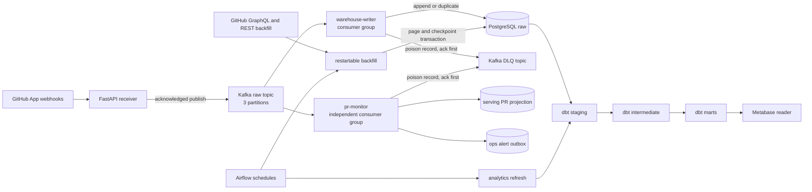

# Architecture

This document describes the implemented local MVP. It is an at-least-once event
pipeline with idempotent durable effects, not an end-to-end exactly-once system.

## Components and data flow

The Compose stack provides one Kafka broker, PostgreSQL, and an optional Metabase
profile. The webhook receiver, both streaming consumers, backfill command, dbt, and
Airflow validation image run as separate processes rather than Compose services.

## Ingestion boundaries

The FastAPI receiver exposes `POST /webhooks/github`. It reads the body with an
enforced byte limit, verifies the `X-Hub-Signature-256` HMAC over those original bytes,
requires `X-GitHub-Event` and `X-GitHub-Delivery`, accepts the five modeled event
families, and validates a strict versioned envelope while preserving unknown fields in
the original payload.

The Kafka producer uses `acks=all`, idempotent producer mode, and the repository full
name as the record key. An HTTP `202` is returned only after the delivery callback
acknowledges the publish. Queue failure, callback failure, or the bounded timeout yields
`503`; merely accepting a record into the local producer queue is not success.

`github.events.raw.v1` has three partitions. Repository-keyed records keep ordering for
a repository while its key-to-partition mapping is stable, but there is no total order
across repositories or partitions. Partition-count changes can change key placement.
Consumers therefore also use stable source identities and source timestamps rather
than treating Kafka arrival order as universal event time.

## Independent durable consumers

`warehouse-writer` and `pr-monitor` use independent consumer groups, so each sees the
raw stream and advances independently. Automatic commits and automatic offset storage
are disabled.

The warehouse writer validates the envelope and attempts an insert into append-only
`raw.github_events`. `(source, source_record_key)` is unique; for webhook events the
source record key is the real GitHub delivery ID. PostgreSQL commits before the worker
synchronously commits the corresponding Kafka offset. A crash in that window can
redeliver the record, but the unique key prevents another durable row.

The PR monitor applies pull-request snapshots and eligible reviews transactionally to
`serving`, then commits its own source offset. Per-PR watermarks stop delayed snapshots
from reopening or regressing newer state. Stable alert keys make repeated stale-PR
sweeps idempotent in `ops.alert_outbox`. External alert delivery is deferred.

If either consumer cannot validate a record, it publishes a versioned dead letter with
base64-encoded source bytes and Kafka lineage. The source offset advances only after
Kafka acknowledges the DLQ record. Database failure, DLQ failure, or offset-commit
failure stops the worker without knowingly advancing past an unconfirmed durable
boundary.

These boundaries provide at-least-once processing with idempotent durable effects.
Kafka acknowledgements, PostgreSQL transactions, and consumer offset commits are
separate boundaries, so the design does not claim end-to-end exactly-once delivery.

## Historical backfill and delayed evidence

The `github-backfill` command reads pull requests, reviews, and commits through GraphQL
and workflow runs, deployments, and deployment statuses through REST. Each API page
and its next cursor are committed in the same PostgreSQL transaction. Re-running a
page is harmless because backfill source keys use stable GitHub object identities plus
resource version or state where needed.

Webhook and backfill snapshots converge in dbt. Staging models normalize both shapes;
intermediate models collapse repeated snapshots and resolve lifecycle state. Exact-SHA
change linkage prefers a merge commit and falls back to an observed PR commit. The
pipeline does not infer Git ancestry. Delayed or redelivered webhooks may therefore
change a later analytics refresh while leaving prior raw history intact.

## Analytics and orchestration

The dbt layers are:

- `analytics_staging`: six contracted views that normalize PRs, reviews, PR commits,
  workflow runs, deployments, and deployment statuses while retaining lineage.
- `analytics_intermediate`: resolved PR lifecycle, first eligible review, production
  evidence, and exact-SHA change-to-deployment linkage.
- `analytics_marts`: repository/date dimensions, PR and deployment facts, daily
  evidence-aware delivery metrics, and sanitized analytics refresh health.

Airflow schedules bounded backfill and hourly analytics work. The manual backfill DAG
delegates to the tested package; the analytics DAG checks freshness, runs the
contracted dbt build, and persists a bounded run ledger. Airflow does **not** poll
Kafka, run the streaming consumers, or orchestrate individual events. Those consumers
are long-running services outside Airflow.

Metabase connects as `metabase_reader`. That role can read the three analytics schemas
and is explicitly denied schema access to `raw`, `serving`, and `ops`. Dashboard SQL is
versioned in the repository; the open-source workflow does not claim paid Metabase
serialization.

## Local topology versus production

The local environment is designed for deterministic review, integration testing, and
failure semantics. It uses one Kafka broker with replication factor one, plaintext
listeners, one PostgreSQL container, local-only passwords, host-bound ports, and a
single-machine Airflow image/DAG smoke path. It is not production infrastructure,
capacity evidence, or a high-availability design.

Kafka exposes a host-advertised listener for processes running on the host and an
internal listener for broker health and in-container administration. This separation
allows isolated Compose projects to use different `KAFKA_PORT` host bindings without
redirecting container-local clients to another project's host port.

A production deployment would need replicated and authenticated Kafka, encrypted
network paths, managed secret injection and rotation, PostgreSQL backup/restore and
high availability, independently supervised receiver and consumer processes,
centralized bounded telemetry, network policy, and a real Airflow scheduler/executor
topology.

## Known limitations and deferred extensions

- Live GitHub App lifecycle validation remains optional and currently unavailable in
  the checked-in deterministic workflow.
- Automated discovery and redelivery of failed GitHub webhooks is not implemented.
- Slack dispatch from the alert outbox is deferred.
- The local raw topic has no schema registry and only repository-key partition
  ordering, not global ordering.
- GitHub workflow history can be capped for broad windows, and deployment-status
  history has an upstream retention limit; the backfill reports rather than hides
  those gaps.
- Failed-deployment recovery, change failure, and unplanned rework remain unavailable
  until defensible intervention evidence is configured and modeled.
- The dashboards are a versioned SQL and screenshot workflow; automatic open-source
  Metabase content import/export is not claimed.

The architecture decisions are recorded in [`docs/adr`](adr/README.md), and metric
semantics are defined in [metric definitions](metric-definitions.md).
